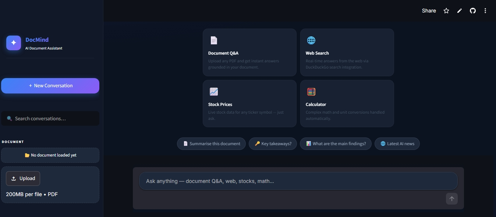
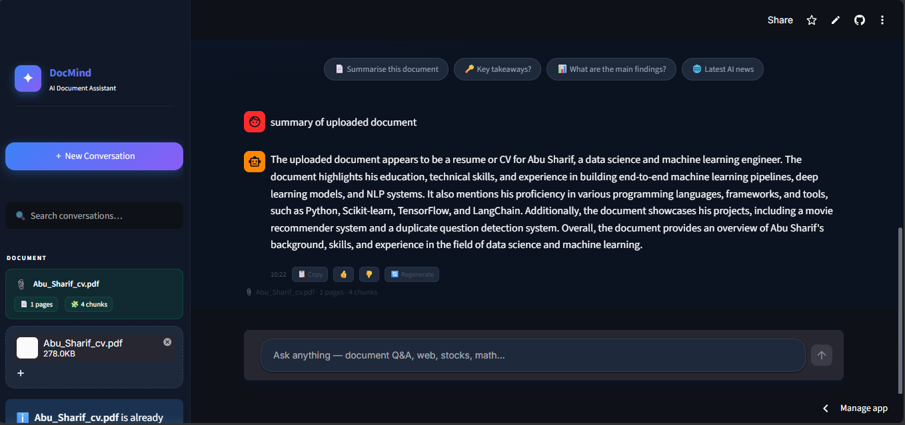
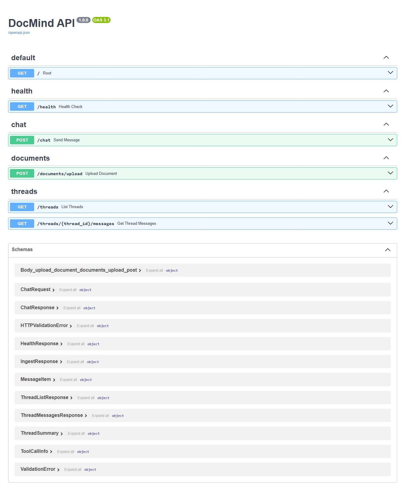

<div align="center">


</div>

<br/>

<p align="center">
  
  
  
  
  
  
  
  
</p>

<p align="center">
  
  
  
</p>

---

## 📖 Overview

> Turn any PDF into a conversational knowledge base — with web search, stock data, and math built in.

**DocMind AI** is a full-stack agentic chatbot that lets you upload PDFs and have intelligent, grounded conversations about their content. Instead of copy-pasting text into a generic chatbot or skimming through long documents manually, DocMind automatically **indexes your PDF**, **routes each question to the right tool**, and returns answers backed by the actual source material.

Built with a production-ready architecture, the project exposes all functionality through a documented **FastAPI REST API** and includes a modern **Streamlit** interface, making it easy to integrate into internal tools, workflows, or customer-facing applications.

The **FastAPI backend** and **Streamlit frontend** are fully decoupled — the UI communicates over HTTP only, so either layer can be deployed, versioned, and scaled independently.

---

## ✨ Key Features

| Category | Capability |
| :--- | :--- |
| 📄 **PDF Document Q&A** | Upload any PDF — DocMind chunks, embeds, and indexes it per thread using FAISS. Answers are grounded in the actual document, not hallucinated. |
| 🌐 **Live Web Search** | Automatically searches DuckDuckGo for questions that need current or external information. No API key required. |
| 📈 **Real-time Stock Prices** | Fetches live quotes for any ticker symbol via Alpha Vantage. |
| 🧮 **Calculator** | Handles arithmetic and unit conversions accurately — no LLM hallucination on math. |
| 💬 **Persistent Chat History** | All conversations stored in SQLite via the LangGraph checkpointer, surviving backend restarts and redeploys. |
| 📂 **Persistent Document Indexes** | FAISS indexes saved to disk per thread — switching to a previous chat that had a PDF attached still works after a restart. |
| 🔀 **Multi-Thread Conversations** | Full sidebar with thread switching, per-thread document state, and conversation search. |
| ⚡ **Agentic Tool Routing** | LangGraph automatically decides which tool to call — RAG, web search, stock API, or calculator — based on the question. |
| 🔌 **Decoupled Frontend / Backend** | Streamlit UI is a pure HTTP client. Point it at any backend via `DOCMIND_API_URL`. |
| 🌐 **REST API** | Fully documented FastAPI endpoints with interactive Swagger / OpenAPI documentation at `/docs`. |

---

## 🚀 What This Project Delivers

* 📄 PDF ingestion, chunking, and FAISS vector indexing
* 💬 Multi-turn conversational memory per thread
* 🔍 Semantic similarity search over uploaded documents
* 🌐 Live web search via DuckDuckGo
* 📈 Real-time stock price lookup
* 🧮 Accurate arithmetic without LLM hallucination
* 🔁 Persistent chat history and document indexes across restarts
* 🌐 Production-ready REST API
* 🖥️ Premium dark-themed Streamlit chat UI
* 📚 Interactive Swagger API documentation

---

## 🚀 Demo

| Service | Link |
| --- | --- |
| Frontend | https://docmind-web.streamlit.app/ |
| Backend API | https://docmind-api-m1kh.onrender.com |
| API Docs (Swagger) | https://docmind-api-m1kh.onrender.com/docs |

---

## 📸 Screenshots

<details>
<summary><b>🏠 Home — Empty State & Feature Overview</b></summary>
<br/>
<p align="center">
  
</p>

The landing screen greets users with a feature grid highlighting Document Q&A, Web Search, Stock Prices, and Calculator capabilities. A clean dark-themed interface with prompt chips makes it immediately clear what DocMind can do.

</details>

<details>
<summary><b>📄 Active Document Q&A Conversation</b></summary>
<br/>
<p align="center">
  
</p>

A PDF is loaded in the sidebar and the RAG tool is active. The assistant retrieves relevant chunks from the document and answers questions grounded in the actual content — not hallucinated responses.

</details>

<details>
<summary><b>📚 Interactive API Documentation</b></summary>
<br/>
<p align="center">
  
</p>

FastAPI auto-generates comprehensive Swagger UI at `/docs`. Developers can explore request schemas, test every endpoint directly in the browser, and integrate the backend into their own applications.

</details>

---

## 🏗 Architecture


```
┌─────────────────────────────────────────────────────────┐
│                    Streamlit Frontend                   │
│   streamlit_app.py ──► api_client.py ──► HTTP requests  │
└──────────────────────────┬──────────────────────────────┘
                           │  REST API (JSON + multipart)
┌──────────────────────────▼──────────────────────────────┐
│                  FastAPI Backend                        │
│                                                         │
│  Routes: /chat  /documents/upload  /threads  /health    │
│                        │                                │
│              LangGraph Workflow                         │
│                        │                                │
│         ┌──────────────▼──────────────┐                 │
│         │         chat_node           │                 │
│         │   Groq LLaMA 3.3 70B        │                 │
│         └──────┬───────────────┬──────┘                 │
│                │  tool_calls   │                        │
│         ┌──────▼──────┐        │                        │
│         │  tool_node  │        │                        │
│         └──┬──┬──┬──┬─┘        │                        │
│            │  │  │  │          │                        │
│         RAG Web $ Calc      END│                        │
│            │                   │                        │
│   ┌────────▼──────┐    ┌───────▼────────┐               │
│   │  FAISS Index  │    │  SQLite (msgs) │               │
│   │  (per thread) │    │  (checkpointer)│               │
│   └───────────────┘    └────────────────┘               │
└─────────────────────────────────────────────────────────┘
```

**How a message flows:**

1. User submits a message → Streamlit calls `POST /chat`
2. FastAPI appends it to the thread's LangGraph state
3. `chat_node` calls Groq — the LLM decides: answer directly, or call a tool?
4. If a tool call is needed, `tool_node` executes it and loops back to `chat_node`
5. The final `AIMessage` is returned as `{ reply, tool_calls, thread_id }`
6. SQLite persists the full message history; FAISS indexes are saved to disk

---

## 🛠 Tech Stack

| Category | Technologies |
| --- | --- |
| **Backend** | FastAPI, Uvicorn, Python 3.11 |
| **Frontend** | Streamlit |
| **Agent Framework** | LangGraph, LangChain |
| **LLM** | Groq · LLaMA 3.3 70B (fast inference, tool calling) |
| **Embeddings** | `sentence-transformers/all-MiniLM-L6-v2` (runs locally, no API cost) |
| **Vector Store** | FAISS CPU (per-thread, persisted to disk) |
| **PDF Parsing** | PyPDF + LangChain document loaders |
| **Web Search** | DuckDuckGo Search (no API key required) |
| **Stock Data** | Alpha Vantage REST API |
| **Persistence** | SQLite + LangGraph `SqliteSaver` |
| **Config** | Pydantic-Settings (`.env` → typed Python objects) |
| **Deployment** | Docker, Fly.io, Streamlit Community Cloud |

---

## 📂 Project Structure

```
docmind/
│
├── app/                            # ── FastAPI backend
│   ├── main.py                     #    App factory, CORS, lifespan startup
│   │
│   ├── api/
│   │   ├── deps.py                 #    Shared FastAPI dependencies
│   │   └── routes/
│   │       ├── health.py           #    GET  /health
│   │       ├── chat.py             #    POST /chat
│   │       ├── documents.py        #    POST /documents/upload
│   │       └── threads.py          #    GET  /threads · GET /threads/{id}/messages
│   │
│   ├── core/
│   │   ├── config.py               #    Pydantic-Settings (all env vars in one place)
│   │   ├── clients.py              #    Groq LLM + HuggingFace embeddings clients
│   │   ├── logging.py              #    Structured logging setup
│   │   └── state.py                #    LangGraph ChatState TypedDict
│   │
│   ├── database/
│   │   └── database.py             #    SQLite init + connection factory
│   │
│   ├── models/
│   │   └── schemas.py              #    Pydantic request / response schemas
│   │
│   └── services/
│       ├── graph.py                #    LangGraph StateGraph builder
│       ├── nodes.py                #    chat_node (LLM + retry) · tool_node
│       ├── tools.py                #    calculator · rag_tool · web_search · get_stock_price
│       ├── prompts.py              #    Dynamic system prompt (document-aware)
│       ├── memory.py               #    SqliteSaver checkpointer
│       ├── retriever.py            #    PDF ingestion → FAISS (disk persist + lazy load)
│       ├── retriever_manager.py    #    In-process thread → retriever cache
│       └── thread.py               #    Thread listing helpers
│
├── frontend/                       # ── Streamlit frontend (pure HTTP client)
│   ├── streamlit_app.py            #    Full UI — zero backend imports
│   ├── api_client.py               #    Thin requests wrapper for every endpoint
│   └── requirements.txt
│
├── screenshots/                    # ── App screenshots for README
│
├── Dockerfile                      # Backend container image
├── requirements.txt                # Backend Python dependencies
├── README.md
├── .env.example                    # Environment variable template
├── .dockerignore
└── .gitignore
```

---

## ⚙️ Installation

```bash
# 1. Clone the repository
git clone https://github.com/Sharif-Abusad/rag-chatbot.git
cd docmind

# 2. Create and activate a virtual environment
python -m venv .venv
source .venv/bin/activate        # Windows: .venv\Scripts\activate

# 3. Install backend dependencies
pip install -r requirements.txt

# 4. Configure environment variables
cp .env.example .env
# Open .env and fill in GROQ_API_KEY and ALPHA_VANTAGE_API_KEY
```

**Run the backend:**

```bash
uvicorn app.main:app --reload --port 8000
```

**Run the frontend** (in a second terminal):

```bash
cd frontend
pip install -r requirements.txt
streamlit run streamlit_app.py
```

Open the URL Streamlit prints — typically `http://localhost:8501`.

> The frontend checks `/health` on every load. If the backend isn't reachable, you'll see a clear error banner rather than a silently broken chat box.

---

## 🔑 Environment Variables

All variables are managed by `app/core/config.py` via Pydantic-Settings. Copy `.env.example` to `.env` to get started.

| Variable | Required | Default | Description |
| --- | --- | --- | --- |
| `GROQ_API_KEY` | ✅ | — | Groq console API key |
| `GROQ_MODEL` | | `llama-3.3-70b-versatile` | Groq model name |
| `ALPHA_VANTAGE_API_KEY` | ✅ | — | Alpha Vantage key for stock prices |
| `EMBEDDING_MODEL` | | `sentence-transformers/all-MiniLM-L6-v2` | HuggingFace embedding model |
| `DATABASE_DIR` | | `./database` | Root dir for SQLite DB + FAISS indexes |
| `MAX_UPLOAD_MB` | | `25` | PDF upload size cap |
| `CORS_ORIGINS` | | `["*"]` | Allowed origins — use exact frontend URL in production |
| `ENVIRONMENT` | | `development` | `development` or `production` |
| `DOCMIND_API_URL` | ✅ (frontend) | `http://localhost:8000` | Backend URL read by the Streamlit client |

> ⚠️ **Never commit `.env`.** It is already in `.gitignore`. In production, use Fly.io secrets or Streamlit Cloud secrets.

---

## 📡 API Documentation

Interactive Swagger docs are auto-generated at `/docs` once the API is running (e.g. `http://localhost:8000/docs`).

| Method | Endpoint | Description |
| --- | --- | --- |
| `GET` | `/health` | Liveness check — returns `{"status": "ok"}` |
| `POST` | `/chat` | Send a message, receive an AI reply with tool usage info |
| `POST` | `/documents/upload` | Upload and index a PDF for a thread |
| `GET` | `/threads` | List all threads with document status |
| `GET` | `/threads/{thread_id}/messages` | Full message history for a thread |

---

## 🔄 Agent Pipeline

```
                   ┌───────────────┐
    User Input ───▶│   POST /chat  │
                   └──────┬────────┘
                          ▼
                   ┌───────────────┐
                   │   chat_node   │  Groq · LLaMA 3.3 70B
                   │   (LLM call)  │
                   └──────┬────────┘
                          │
          ┌───────────────┼──────────────────┐
          │ tool_calls?   │                  │
          ▼               │ no               │
   ┌─────────────┐        │                  │
   │  tool_node  │        │                  │
   └──┬───┬───┬──┘        │                  │
      │   │   │           │                  │
      ▼   ▼   ▼           ▼                  ▼
    RAG  Web  $     Direct Answer         Calculator
      │   │   │           │
      └───┴───┘           │
          │               │
          ▼               ▼
      loop back ──▶  chat_node ──▶  Final Reply → User
```

---

## 💾 Persistence & Data

```
database/
├── chat_history.db                       ← SQLite (all threads, all messages)
└── faiss_indexes/
    └── <thread_id>/
        ├── index.faiss                   ← FAISS vector index for this thread's PDF
        └── metadata.json                 ← filename, page count, chunk count
```

When the backend restarts, the in-process cache starts empty. On the first query for a given thread:

1. `get_retriever(thread_id)` checks the in-memory cache → **miss**
2. Falls back to `FAISS.load_local()` from disk → **populates cache**
3. All subsequent queries hit the **in-memory cache**

The cold-start cost is a single disk read per thread per process lifetime — everything after is fast.

> **Scaling caveat:** This setup is designed for a single backend process. For horizontal scaling, swap `SqliteSaver` for [`langgraph-checkpoint-postgres`](https://pypi.org/project/langgraph-checkpoint-postgres/) and FAISS for a hosted vector DB ([Qdrant](https://qdrant.tech) / [pgvector](https://github.com/pgvector/pgvector)).

---

## 🗺 Future Improvements

- [ ] API key / JWT authentication on all routes
- [ ] Per-IP rate limiting on `/chat` and `/documents/upload`
- [ ] Multi-document support per thread
- [ ] Docker Compose — one-command local stack
- [ ] GitHub Actions CI — lint, type-check, test on push
- [ ] Unit + integration tests for the services layer
- [ ] Postgres + Qdrant backend for horizontal scaling

---

## 🤝 Contributing

Contributions are welcome.

1. Fork the repository
2. Create a feature branch: `git checkout -b feature/your-feature`
3. Commit your changes: `git commit -m "Add your feature"`
4. Push to your branch: `git push origin feature/your-feature`
5. Open a Pull Request describing the change and its motivation

Please open an issue before submitting a large PR so we can align on the approach first.

---

## 📄 License

This project is licensed under the **MIT License** — see [LICENSE](LICENSE) for details.

---

## 👤 Author

<div align="center">

**Sharif Abusad**

[](https://github.com/Sharif-Abusad)
[](https://linkedin.com/in/sharif-abusad)

*If you found this project useful, consider giving it a ⭐ on GitHub — it helps a lot!*

</div>

---

<p align="center">
Made with ❤️ using Python and Open Source Technologies
</p>